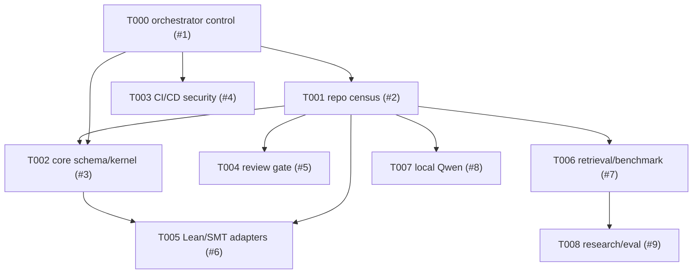

# Agent Task Graph

Created at: 2026-05-10T21:48:13Z

Repository: https://github.com/Porrrrrrg/Formal-Aware-AI-DV-Copilot

Main issue: https://github.com/Porrrrrrg/Formal-Aware-AI-DV-Copilot/issues/1

Review packet URL: `unspecified`

## Operating Rules

- GitHub issues and PR comments are the control plane.
- Repo artifacts under `docs/`, `reports/`, and `artifacts/runs/` are the evidence plane.
- Branch names must follow `codex/<agent>/<issue-number>-<slug>`.
- Run artifacts must be written under `artifacts/runs/<date>/<run_id>/`.
- Missing URLs, versions, datasets, packets, credentials, and external tool versions must be recorded as `unspecified`.
- No two agents may write the same subsystem at the same time.
- No business logic changes are allowed until the relevant task is unblocked and owned.
- The dependency graph must remain a DAG.

## Bootstrap Repo Census

This is an orchestrator-observed bootstrap census. The Repo Auditor candidate is `reports/audits/repo_census_20260510_214819.md`.

- Current branch: `codex/orchestrator/init-task-graph`
- Base commit: `3bb6821e687db39d384abd7f6fcb00cee6f7c6c1`
- Default branch: `main`
- Tracked file count from `git ls-files`: 152
- Tracked top-level directories: `benchmarks/`, `copilot/`, `docs/`, `evaluation/`, `jasper/`, `scripts/`, `tools/`
- Packaging: `pyproject.toml`, Python `>=3.10`, empty dependency list
- Existing schema location: `copilot/schemas/`
- Existing benchmark/eval paths: `benchmarks/`, `evaluation/`, `evaluation/results/`
- Existing JasperGold flow paths: `jasper/common/`, `tools/run_jasper.py`, `scripts/run_moore_*.sh`
- Missing from tracked tree: `.github/workflows/`, `tests/`, top-level `schemas/`
- Server environment from user: `ssh moore; source /vol/eecs391/cadence.env`
- Review packet: `unspecified`

## Task Table

| Task | Owner | Issue | PR | Subsystem | Status | Branch | Dependencies |
|---|---|---:|---|---|---|---|---|
| T000_orchestrator_control | orchestrator | #1 | unopened | orchestration | in_progress | `codex/orchestrator/init-task-graph` | none |
| T001_repo_census | repo-auditor | #2 | unopened | reports/audits | artifact_detected_unreviewed | `codex/repo-auditor/2-repo-census` | none |
| T002_core_schema_kernel | kernel | #3 | unopened | schemas-core | artifact_detected_unreviewed | `codex/kernel/3-core-schema` | T001 |
| T003_cicd_security | cicd-security | #4 | unopened | cicd-security | artifact_detected_unreviewed | `codex/cicd-security/4-ci-security-baseline` | none |
| T004_review_gate | code-reviewer | #5 | unopened | review-process | artifact_detected_unreviewed | `codex/code-reviewer/5-review-gate` | T001 |
| T005_lean_smt_adapters | lean-smt | #6 | unopened | adapters-lean-smt | artifact_detected_unreviewed | `codex/lean-smt/6-adapter-plan` | T001, T002 |
| T006_retrieval_benchmark | retrieval-benchmark | #7 | unopened | benchmarks-retrieval | artifact_detected_unreviewed | `codex/retrieval-benchmark/7-benchmark-inventory` | T001 |
| T007_local_qwen | local-qwen | #8 | unopened | local-llm | artifact_detected_unreviewed | `codex/local-qwen/8-local-qwen-plan` | T001 |
| T008_research_eval | research-eval | #9 | unopened | research-eval | artifact_detected_unreviewed | `codex/research-eval/9-eval-protocol` | T001, T006 |

## DAG

There are no reverse edges from downstream tasks to T001, so the graph has no closed-loop dependency.

## Locks And Ownership

| Subsystem | Owner | Write Paths | Notes |
|---|---|---|---|
| orchestration | orchestrator | `docs/agents/task_graph.md`, `reports/status/**`, `artifacts/runs/**/manifest.json` | Control artifacts only |
| reports/audits | repo-auditor | `reports/audits/**` | First gate; read-only over rest of repo |
| schemas-core | kernel | `schemas/**`, `copilot/models/**`, `tests/**` | Skeleton-only before census |
| cicd-security | cicd-security | `.github/**`, `security/**`, `ops/**`, `reports/security/**` | Must not run proprietary EDA in public CI |
| review-process | code-reviewer | `docs/agents/review_gate.md`, `docs/agents/pr_acceptance_rubric.md`, `reports/reviews/**` | Policy and PR review only |
| adapters-lean-smt | lean-smt | `adapters/lean/**`, `adapters/smt/**`, `docs/adapters/**`, `reports/adapters/**`, `tests/adapters/**` | Blocked until census and core schema |
| benchmarks-retrieval | retrieval-benchmark | `reports/eval/**`, `docs/benchmarks/**`, `retrieval/**`, `tests/retrieval/**` | Coordinate report filenames with research-eval |
| local-llm | local-qwen | `ops/local-llm/**`, `docs/local-llm/**`, `reports/local-llm/**` | Must keep model and GPU versions explicit or `unspecified` |
| research-eval | research-eval | `reports/eval/**`, `docs/research/**` | Must not overwrite retrieval-benchmark files |

## Message Schema

All cross-agent messages must be JSON inside a GitHub issue or PR comment.

Required fields:

- `type`: one of `TASK_ASSIGN`, `TASK_CLAIM`, `ARTIFACT_READY`, `BLOCKED`, `REVIEW_REQUESTED`, `REVIEW_FINDING`, `MERGE_READY`, `RUN_SUMMARY`, `ESCALATE`
- `task_id`
- `from`
- `to`
- `issue`
- `subsystem`
- `branch`
- `inputs`
- `outputs`
- `acceptance_commands`
- `dependencies`
- `blocking_conditions`

## Start Gate

Parallel start was authorized only for:

- T001 Repo Auditor: full census work.
- T002 Core Kernel: schema skeleton only; no repo-native model alignment until T001 is accepted.
- T003 CI/CD Security: low-coupling compile/eval workflow and security baseline only.

Parallel artifacts for other tasks are detected locally and are treated as unreviewed until PR-linked.

## Detected Parallel Artifacts

These paths are present in the shared worktree but are not yet committed, PR-linked, or reviewed.

| Task | Detected paths | Current action |
|---|---|---|
| T001_repo_census | `reports/audits/repo_census_20260510_214819.md`, `reports/audits/dependency_inventory_20260510_214819.md`, `reports/audits/security_surface_20260510_214819.md`, `reports/audits/repo_tree_20260510_214819.txt` | Accept as census candidate; require issue #2 ARTIFACT_READY and review |
| T002_core_schema_kernel | `schemas/v1/core.schema.json`, `app/models/**`, `app/core/**`, `core/**`, `tests/core/**`, `docs/architecture/typed_ir.md` | Review for path drift and schema/model duplication |
| T003_cicd_security | `.github/PULL_REQUEST_TEMPLATE.md`, `.github/workflows/ci.yml`, `.github/workflows/nightly-bench.yml`, `.github/workflows/release-attest.yml`, `docs/security/ci_security.md`, `.gitignore`, `pyproject.toml`, `tests/test_repo_contracts.py` | Review action versions, permissions, dependencies, and offline/Jasper boundaries before PR |
| T004_review_gate | `docs/review/review_checklist.md`, `reports/review/pr_none_review_20260510T214801Z.md`, `reports/review/pr_local_review_20260510T215546Z.md` | Map to #5; review output path mismatch against assigned `docs/agents/**` |
| T005_lean_smt_adapters | `adapters/**`, `benchmarks/lean_smt_smoke/**`, `tests/adapters/**`, `docs/integration/lean_smt.md`, `Makefile` | Review scope and tool availability before PR |
| T006_retrieval_benchmark | `app/retrieval/**`, `benchmarks/local_dv/**`, `tests/retrieval/**`, `reports/eval/local_dv/**` | Review contamination, split policy, and repeated run directories before accepting |
| T007_local_qwen | `ops/local-llm/**`, `docs/local-llm/qwen_3090ti.md` | Review model/version/GPU assumptions |
| T008_research_eval | `docs/research/**`, `reports/research/**`, `artifacts/runs/2026-05-10/research_baseline_20260510T214913Z/**` | Review generated metrics and ensure no tracked result overwrite |

Because multiple agents wrote into one shared worktree, the next orchestrator action is to freeze new writes, review the diff by subsystem, and split each owner set into separate branches/PRs.

## Blocked Task Policy

When an agent posts `BLOCKED`, the orchestrator must choose one action within the next status update:

- `retry`: use when the blocker is transient, such as CI outage or command timeout.
- `split`: use when the task is too broad or one output can proceed independently.
- `escalate`: use when credentials, proprietary tool access, server access, model selection, or product scope requires a human decision.

## Status Cadence

- Orchestrator status reports are due every 4 hours.
- Current status artifact: `reports/status/orchestrator_status_20260510T214813Z.md`
- Current run manifest: `artifacts/runs/2026-05-10/run_20260510T214813Z_3bb6821_orch01/manifest.json`
